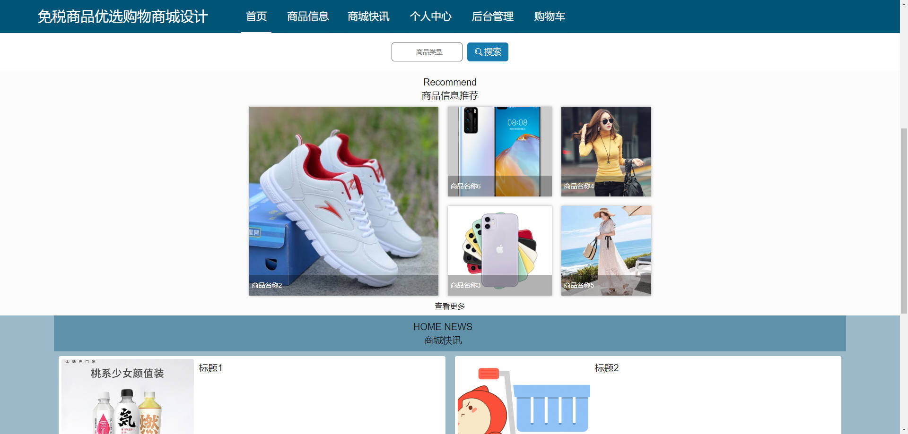
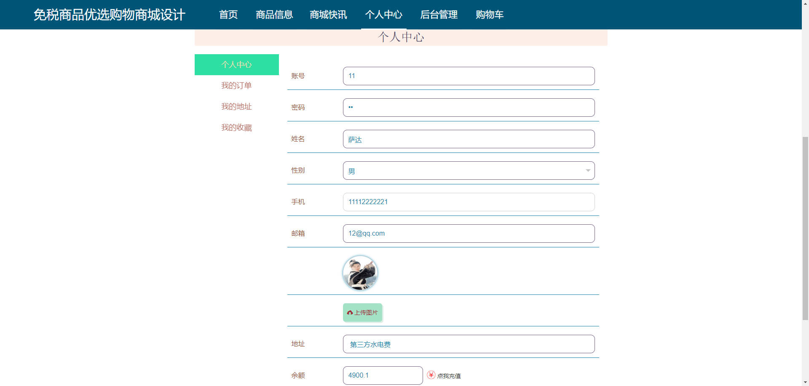
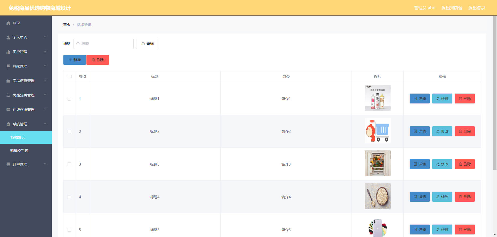

# 基于Springboot的免税商品优选购物商城

## Springboot-0020


## 技术栈

Springboot mybatisplus vue mysql maven


## 数据库表(15张)


## 功能介绍

```properties
客户子系统：用户注册；用户登录；商品浏览界面；加入购物袋；可进行商品收藏并查看；下订单订购商品并支付；查看订单；修改订单；商品查询；修改密码；修改个人信息；售后服务客服。

商家子系统：用户注册商家资料并提交审核申请；用户登录；修改密码；修改个人信息；设置商品信息；查看订单；人工客服等。

管理员子系统：系统管理员对客户，商户系统进行管理，系统管理包括以下需求：用户管理，客户注册，商户注册；对商户资料进行审核。

```


## 图片

### 前台








### 后台





## 访问路径

### 前台

```properties
http://localhost:8080/springboot1a8gh/front/pages/login/login.html

账号 11
密码 11
```

### 后台

```properties
http://localhost:8080/springboot1a8gh/admin/dist/index.html#/login

账号 abo
密码 abo
```


## 功能图


## 文档目录


## 打赏或交流


